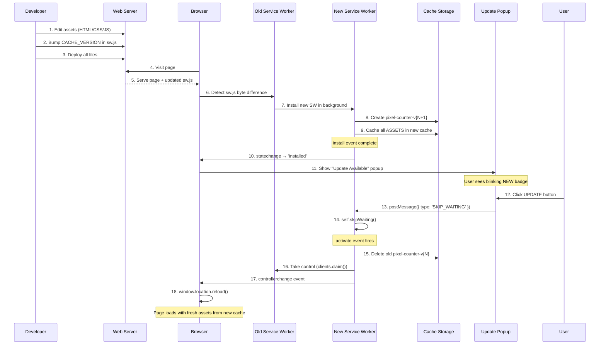
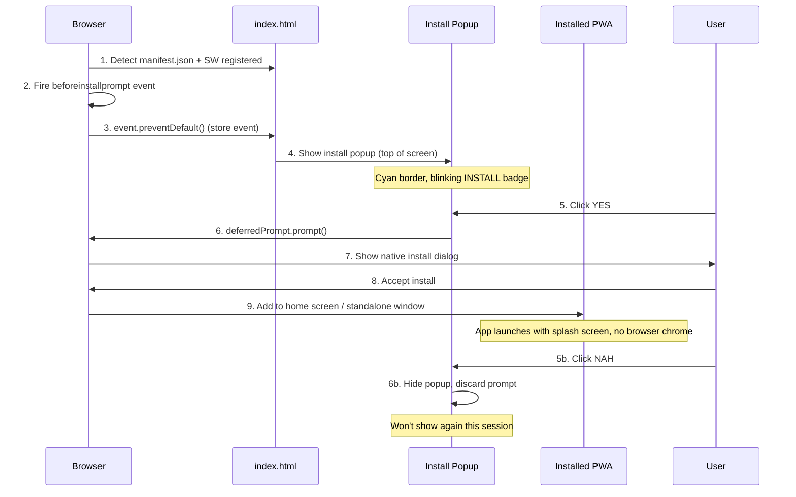

# PWA Strategy Guide — Pixel Counter

## Architecture Overview

```
┌─────────────────────────────────────────────────────────────┐
│                     Browser / PWA Shell                      │
│  ┌──────────┐  ┌──────────────┐  ┌──────────────┐  ┌────┐  │
│  │ counter  │  │ update-popup │  │install-popup │  │manifest │
│  │  .html   │  │  (UI layer)  │  │ (UI layer)   │  │ .json  │
│  └────┬─────┘  └──────┬───────┘  └──────┬───────┘  └────┘  │
│       │               │                      │              │
│  ┌────▼───────────────▼──────────────────────▼───────────┐  │
│  │              Service Worker (sw.js)                    │  │
│  │  ┌──────────┐  ┌──────────┐  ┌─────────────────────┐  │  │
│  │  │ Install  │  │ Activate │  │  Fetch (cache-first  │  │  │
│  │  │ (cache   │  │ (clean   │  │  + stale-while-     │  │  │
│  │  │ assets)  │  │ old caches)│  └─────────┬───────────┘  │  │
│  │  └──────────┘  └──────────┘  │           │              │
│  │                              │           ▼              │
│  │  ┌───────────────────────────┴──────────────────────┐  │
│  │  │           Cache Storage                          │  │
│  │  │  pixel-counter-v{N}                              │  │
│  │  │  ├─ /                     (HTML)                 │  │
│  │  │  ├─ /index.html         (HTML)                 │  │
│  │  │  ├─ /manifest.json        (PWA manifest)         │  │
│  │  │  ├─ /icon.svg             (app icon)             │  │
│  │  │  └─ /sw.js                (service worker)       │  │
│  │  └──────────────────────────────────────────────────┘  │
│  └────────────────────────────────────────────────────────┘
└─────────────────────────────────────────────────────────────┘
```

---

## Update Deployment Workflow



---

## Install Prompt Workflow



### Dismiss behavior
- **YES** → fires native browser install prompt; on accept, app is installed
- **NAH** → hides popup and discards the deferred event (won't reappear until next page visit)
- Popup is positioned at the **top** of the screen (update popup is at the bottom) so both can coexist

### Requirements for the prompt to fire
| Condition | Detail |
|---|---|
| HTTPS or localhost | Required for all PWA features |
| Valid manifest.json | Must have name, icons, display, start_url |
| Active service worker | Must be registered and activated |
| User engagement | User must interact with the page before prompt |

---

## Caching Strategy

### On Install (Pre-cache)
When a new service worker installs, it creates a versioned cache and pre-caches all critical assets:

| Asset | Purpose |
|---|---|
| `/` | Root HTML entry point |
| `/index.html` | Explicit HTML fallback |
| `/manifest.json` | PWA install manifest |
| `/icon.svg` | App icon |
| `/sw.js` | Service worker itself |

### On Fetch (Cache-first + Stale-While-Revalidate)

```
         ┌──────────┐
         │  Request  │
         └────┬─────┘
              │
              ▼
       ┌──────────────┐
       │  caches.match │
       └──────┬───────┘
              │
         ┌────┴────┐
         │         │
         ▼         ▼
    ┌────────┐ ┌────────────┐
    │ Cached │ │ Not Cached │
    └───┬────┘ └─────┬──────┘
        │            │
        │            ▼
        │      ┌──────────┐
        │      │ fetch()  │
        │      └────┬─────┘
        │           │
        │      ┌────┴─────┐
        │      │          │
        │      ▼          ▼
        │ ┌────────┐ ┌────────┐
        │ │ 200 OK │ │ Fail   │
        │ │(cache+)│ │ 404    │
        │ │ return │ └────────┘
        │ └────────┘
        │
        │ (background)
        ▼
  ┌──────────────┐
  │ fetch(net)   │
  │ (silent)     │
  │ update cache │
  └──────────────┘
```

The cache is checked **first** and the response is returned **immediately** — no network wait. A network fetch runs **silently in the background** (left branch) to refresh the cache for the next visit. If the resource isn't cached (right branch), the handler waits for the network response and caches it on success. This guarantees instant loading from the home screen even when fully offline.

---

## Versioning Contract

### Deploying an Update

```
sw.js (line 1):
────────────────────────────────────────────────────
const CACHE_VERSION = 0.3;   ← BUMP THIS on every deploy
────────────────────────────────────────────────────
```

| Step | Action |
|---|---|
| 1 | Edit HTML, CSS, or other assets |
| 2 | Increment `CACHE_VERSION` in `sw.js` |
| 3 | Deploy everything to the server |
| 4 | Browser detects changed `sw.js` bytes |
| 5 | Update popup appears → user clicks UPDATE |
| 6 | New SW activates with fresh cache, old cache deleted |

### Why byte comparison works
Browsers detect service worker updates by comparing `sw.js` bytes. Bumping `CACHE_VERSION` changes the file content, which triggers the browser's update check on every navigation (or every 24h in Chrome). No additional polling or build tools needed.

---

## Key Files

| File | Role |
|---|---|
| `index.html` | App shell + SW registration + update popup + install popup UI |
| `sw.js` | Service worker: install, activate, fetch, messaging |
| `manifest.json` | PWA metadata for install prompt |
| `icon.svg` | App icon (512×512, pixel art) |

---

## Update Popup Behavior

| Trigger | Condition |
|---|---|
| **Appears** | New SW installs while old SW is still active (waiting state) |
| **UPDATE** | Sends `SKIP_WAITING` → new SW activates → page reloads |
| **✕ (dismiss)** | Hides popup until next page visit (SW still waiting) |
| **Next visit** | Waiting SW activates on next navigation automatically |

The popup uses the same 16-bit pixel aesthetic (`Press Start 2P` font, blinking `NEW` badge, double border) to match the app's visual identity.

---

## Install Popup Behavior

| Trigger | Condition |
|---|---|
| **Appears** | `beforeinstallprompt` fires (browser determines PWA installable) |
| **YES** | Calls `deferredPrompt.prompt()` → native install dialog → app installed on accept |
| **NAH** | Hides popup, discards deferred prompt (won't show again until next page visit) |
| **Position** | Top center of screen (update popup is bottom center — no overlap) |

### Visual identity
- **Border**: cyan (`#0ff`) with cyan double-shadow to distinguish from the update popup (white)
- **Badge**: cyan background with `INSTALL` label, blinking animation
- **YES button**: cyan background, black text
- **NAH button**: transparent, dim text
- The popup is positioned at the **top** of the screen so both popups can coexist without overlapping
